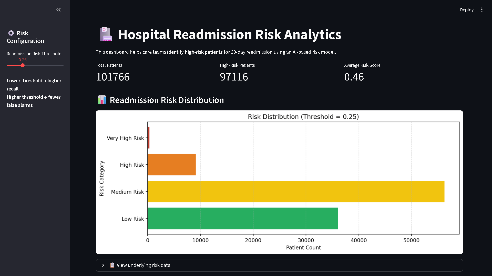
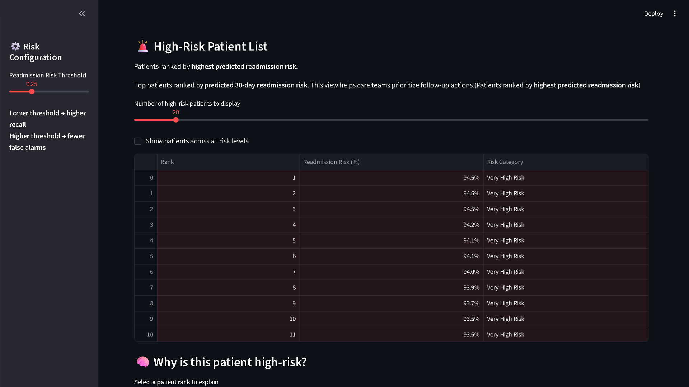
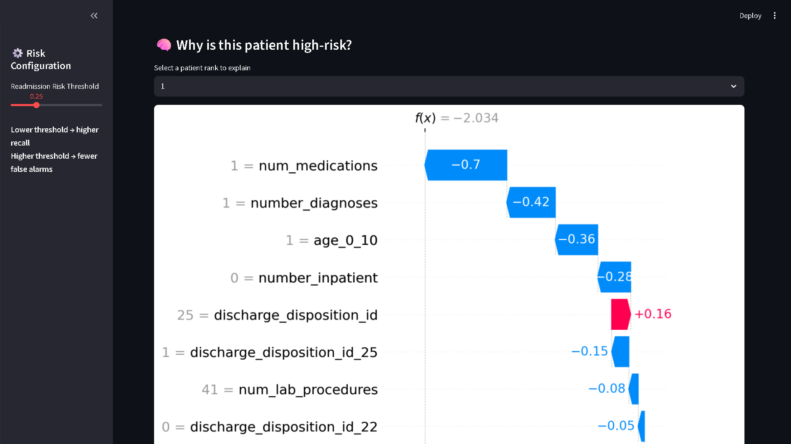
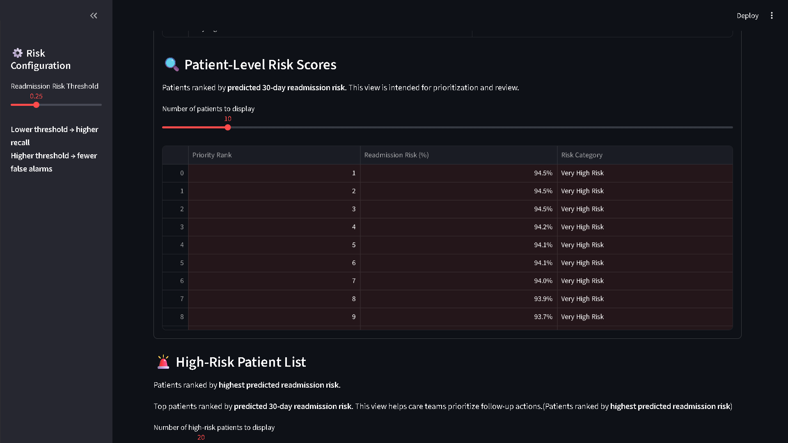

# 🏥 AI Hospital Readmission Risk Analytics

An end-to-end AI-powered healthcare analytics platform designed to predict 30-day hospital readmission risk, identify high-risk patients, and support proactive clinical intervention strategies using machine learning and explainable AI.

This project combines predictive modeling, healthcare analytics, explainable AI (XAI), and interactive dashboard visualization to simulate how hospitals can reduce preventable readmissions and improve operational efficiency.

---

# 🚀 Project Overview

Hospital readmissions are one of the most critical operational and financial challenges in healthcare systems.

This platform demonstrates how AI can:

* identify patients at high risk of readmission
* prioritize intervention workflows
* improve discharge planning
* support clinical decision-making
* reduce avoidable healthcare costs

The system includes:

* machine learning risk prediction
* patient-level scoring
* SHAP explainability
* risk segmentation
* healthcare dashboard analytics
* operational intelligence reporting

---

# 🧩 Key Capabilities

* Predict 30-day hospital readmission risk
* Prioritize high-risk patients for intervention
* Generate explainable AI insights using SHAP
* Support healthcare resource optimization
* Improve discharge planning intelligence
* Enable patient-level risk segmentation
* Assist operational healthcare analytics teams

---

# 📊 Dashboard Preview

## 🏥 Hospital Readmission Risk Dashboard



---

## 🚨 High-Risk Patient Prioritization



---

## 🧠 Explainable AI — SHAP Analysis



---

## 📋 Patient-Level Risk Scores



---

# ⚙️ Platform Features

## 🤖 AI Prediction Engine

* XGBoost-based classification model
* 30-day readmission prediction
* patient-level risk scoring
* risk probability estimation
* threshold-based classification
* healthcare-oriented recall optimization

---

## 🧠 Explainable AI (XAI)

* SHAP explainability integration
* patient-level feature attribution
* interpretable risk insights
* transparent prediction analysis
* clinical decision support visibility

---

## 📈 Healthcare Analytics

* readmission risk distribution
* patient segmentation
* risk category analysis
* high-risk patient ranking
* operational healthcare insights
* clinical workflow prioritization

---

## 📊 Interactive Dashboard

Built using Streamlit with:

* dynamic risk threshold controls
* patient ranking interface
* SHAP explainability visualization
* interactive filtering
* healthcare intelligence reporting
* downloadable outputs

---

# 📉 Model Performance

Evaluation metrics used:

* Accuracy
* Precision
* Recall
* F1-Score
* ROC-AUC

The XGBoost model was optimized for healthcare risk prioritization and high recall detection to minimize missed high-risk patients.

---

# 🏥 Healthcare Use Cases

This platform can support:

* hospital discharge planning
* patient intervention prioritization
* care coordination teams
* insurance risk analytics
* population health management
* clinical operations monitoring
* healthcare analytics transformation initiatives

---

# 🛠️ Tech Stack

## Programming & Frameworks

* Python
* Streamlit

## Machine Learning

* XGBoost
* Scikit-learn

## Data Analytics

* Pandas
* NumPy

## Visualization

* Matplotlib
* SHAP

---

# 📂 Project Structure

```bash
AI-Hospital-Readmission-Risk/
│
├── data/
│   ├── raw/
│   └── processed/
│
├── src/
│   ├── preprocessing.py
│   ├── features.py
│   ├── train.py
│   └── evaluate.py
│
├── dashboard/
│   └── app.py
│
├── models/
│   ├── xgb_classifier_readmission_model.pkl
│   └── model_metadata.json
│
├── screenshots/
│   ├── risk_distribution.png
│   ├── patient_risk_scores.png
│   ├── high_risk_patients.png
│   └── shap_explainability.png
│
├── outputs/
│   └── visuals/
│       ├── risk_distribution.png
│       ├── shap_explainability.png
│       ├── patient_count_by_risk.csv
│       ├── patient_risk_scores.csv
│       ├── high_risk_patients.csv
│       └── patient_risk_summary.txt
│
├── reports/
│   └── executive_summary.md
│
├── README.md
├── .gitignore
└── requirements.txt
```

---

# ▶️ Installation & Setup

## 1️⃣ Clone Repository

```bash
git clone https://github.com/girishshenoy16/AI-Hospital-Readmission-Risk.git
cd AI-Hospital-Readmission-Risk
```

---

## 2️⃣ Install Dependencies

```bash
pip install -r requirements.txt
```

---

## 3️⃣ Run data pipeline

```bash
python src/preprocessing.py
python src/features.py
python src/train.py
python src/evaluate.py
```

---

## 4️⃣ Launch dashboard

```bash
streamlit run dashboard/app.py
```

---

# 📁 Outputs Generated

The platform generates:

* patient risk score reports
* high-risk patient rankings
* SHAP explainability visuals
* healthcare analytics summaries
* operational intelligence reports
* downloadable CSV outputs

---

# 🌍 Why This Project Matters

Healthcare organizations generate massive volumes of patient data, yet many operational decisions remain reactive.

This project demonstrates how AI-powered healthcare analytics can transform raw clinical data into proactive patient risk intelligence, helping healthcare providers improve patient outcomes while reducing operational and financial strain.

---

# 👨‍💻 Author

Girish Shenoy

Aspiring AI & Data Analytics Professional focused on:

* Healthcare AI
* Predictive Analytics
* Business Intelligence
* Explainable Machine Learning
* AI-Powered Decision Systems

---

# 🙌 Acknowledgements

Guided by Umesh Yadav Sir under EDC, IIT Delhi in association with the Indian Institute of Placement.

---